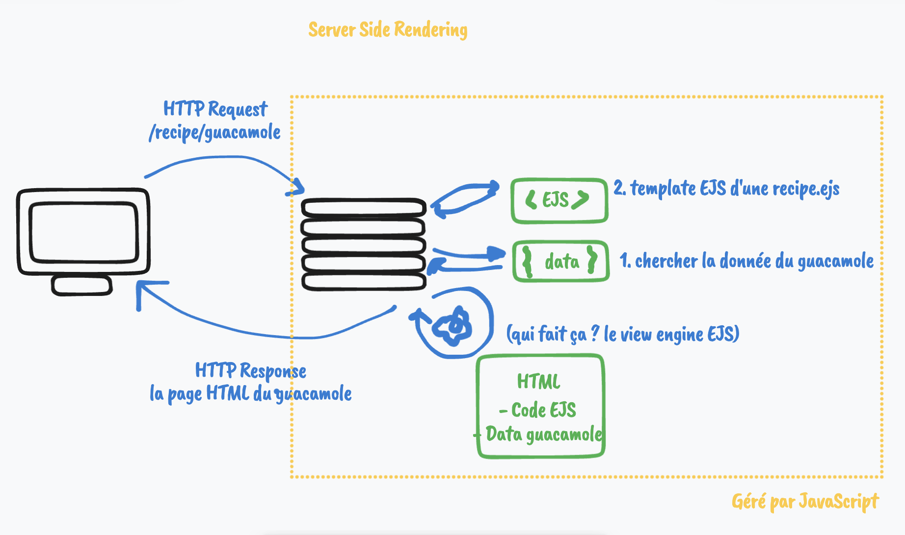
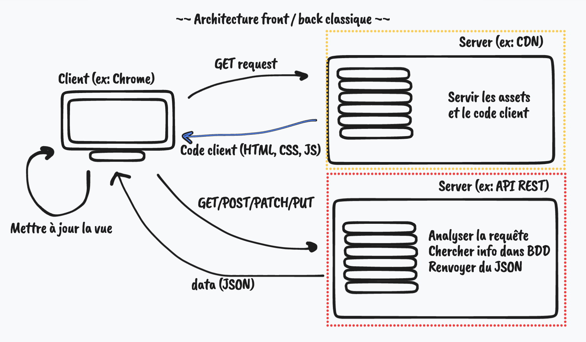

# O'Kanban - E01 - API & AJAX

## Menu du jour

- Cockpit
  - Architecture Client - Serveur
  - Principe `API`
  - Découverte `AJAX`
  - Setup `GitHub`

- Atelier
  - `MCD`
  - `User stories`
  - `Wireframes`

## Convention des commits

On peut se la jouer pro avec une convention de nommage des commits [voir ici](https://www.conventionalcommits.org/en/v1.0.0/).

## Architecture client-serveur

En saison 3/4/5, on calculait une page HTML à partir de données et d'un template EJS, qu'on renvoyait au client. On appelle cette approche du `Serveur Side Rendering`

En saison 6/7, on découvre une archi client-serveur, avec du code client (S07) et du code backend (S06), à savoir une API. 

### Avatanges du client-serveur

- On ne recharge plus la page au complet, on y ajoute au fur et à mesure de la données qu'on va chercher sur une API. => plus dynamique. 
- `SOC` : 
  - une vrai distinction entre 
    - "code d'affichage" (front)
    - "code gestion des données" (back)
- Facilite l'ajout de nouveaux "clients" : 
  - Tous les clients (ex: Navigateurs (chrome, safari) / ex : Mobiles (iOS ou Android)) iront consommer la même API !
- Changer de technologie frontend plus "facilement" : 
  - "mon code Vanilla JS est naze, je passe sur React !"

### Inconvenients du client-serveur

- Deux codes à maintenir (code client et code serveur), potentiellement plus lourd et overkill pour un petit projet. 
- Parfois moins bon pour le `SEO` (car les données varient en fonction des journées)

## API

- `API` = Application Programming Interface 
  - Façade
  - liste de "fonctions" disponibles à utiliser. 

- `API web` = `API HTTP` = `API REST`
  - Un ensemble de `routes` HTTP qui nous renvoie ou nous permette de manipuler de la donnée.

- On distingue des API web "publique" (ex: `swapi`, `pokeapi`...) et des API web "privée" (uniquement utilisé par une entreprise sur son front)

Si on a des données "temps réelles" que l'on veut rendre disponible en permanence facilement à divers Client, alors créer une API autour de ces données est un très bon moyen de les rendre accessibles.

`Trains RATP` : il existe surement une API des trains qui nous donne les arrivées/départs...
- Publique ?? A voir, peut-être est elle juste privée dans la RATP.
- En partie ?? 
  - Plusieurs sites/applications capable de nous données les arrivées de trains :
    - CityMapper
    - GoogleMaps

Une API web : 
- c'est une boite qui nous renvoie/gère de la donnée (donc l'API est connecté à une BDD forcement). 
- c'est une façade d'accès à une BDD

En terme de droit : 
- on regarde la documentation, s'il y a des règles à respecté

En terme d'accès : 
- il faut parfois s'authentifier pour utiliser une API. On nous fournit alors une API KEY pour faire nos requêtes.

### Exemples d'API Publiques

Bienvenue dans le vaste monde des API

- https://reqres.in/
  - pour des fakes données
- https://swapi.dev/
  - pour les données des films Star Wars
- https://www.omdbapi.com/
  - rechercher des films et les données des films
- https://numerique.sncf.com/startup/api/token-developpeur/
  - Données des gares SNCF
- https://www.data.gouv.fr/fr/
  - Pleins d'APIs lié à la "France"
  - ex: https://geo.api.gouv.fr/regions
- https://pokeapi.co/
  - Pokemons Api
- https://fr.openfoodfacts.org/data
  - Données sur la nourriture
- https://developer.spotify.com/documentation/web-api/reference/
  - Spotify API
- https://github.com/public-api-lists/public-api-lists
  - Liste GitHub avec pleins d'API

Dans la majorité des cas, une API web renvoie des données au format `JSON`

### Saison 6 ? 

Dans cette saison, nous n'allons pas utiliser (consommer) une API existante, nous allons la CONSTRUIRE. Notre API sera "privée" (parce qu'on va pas la mettre en ligne pour les autres)

### Saison 7 ? 

On consomme l'API de la saison 6.
- on refait du front. 
- on se re-casse la tête sur les `addEventListener` / `document.querySelector`

Comment on anticipie cette S07 ? 
- Exo Ocode de S02 à revoir
  
Mais surtout (et plus ludique) : 
  - on choisit n'IMPORTE QUELLE API qui vous fait plaisir, et on construit un petit front avec 

## Une API Web HTTP peut se requêter avec PLEINs d'outils différent

Ex : `https://geo.api.gouv.fr/regions`

- Depuis Chrome via la `barre d'URL`
- Depuis `fetch` dans code Javascript
- Via `curl` dans le terminal (ex: `curl https://geo.api.gouv.fr/regions`)
- Via Insomnia/Postman
- Via ton téléphone depuis une application iOS. 
