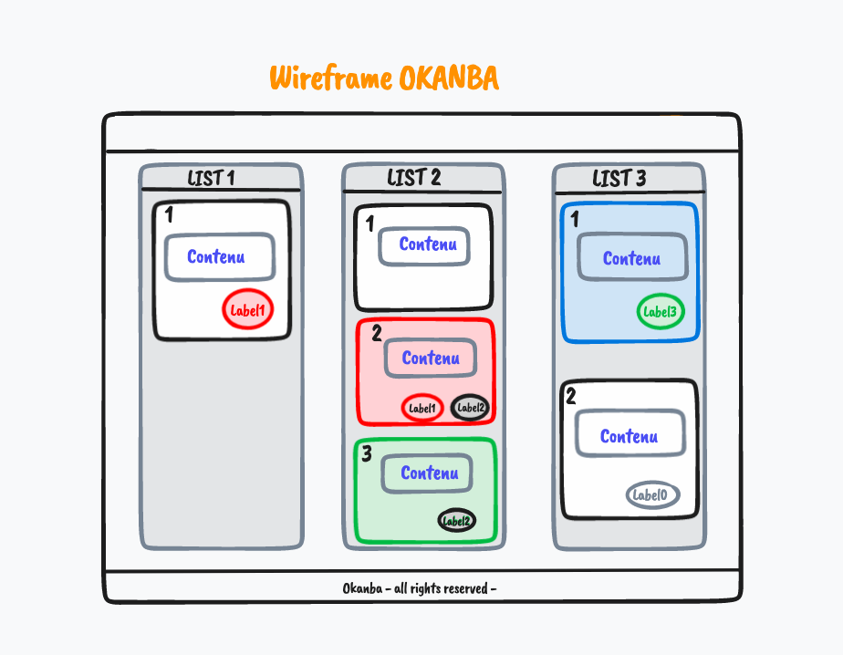

# O'Kanban - E01 - Modelisation base de données

## Menu du jour

- Cockpit
  - Correction 
    - `MCD` 
    - `User-stories`
    - `Wireframe`
  - Gitflow multi-remote

- Atelier
  - `MLD` (traduction technique du MCD) 
  - `MPD` (création des tables et seeding dans Postgres)
  - `Sequelize` (connexion à la BDD et modèles)

## UML, MCD, MLD, MPD rappels

`UML` = `Unified Modeling Language`

C'est un langage (orienté objet) pour définir des objects visuels pour nous aider à faire de la modélisation. 

`MERISE` = MCD => MLD => MPD 

- MCD : pour mamie
- MLD : pour les techos
- MPD : pour le SGBD

Objectif MCD : 
- Modéliser notre problématique pour savoir ce qu'on a besoin de stocker. 

Objectif MLD : 
- faire apparaitre les clés primaires / étrangères
- faire apparaitre les tables de liaisons
- faire apparaitre les noms exacts des champs de ma base de données, et leur "type"

Objectif MPD : 
- faire entrer les données dans un SGBD

## MCD

⚠️ User stories avant MCD permet de mieux définir notre besoin avant de se demander : qu'est-ce qu'on a besoin de stocker ⚠️ 

1. Lister nos entités
- `liste`
- `carte`
- `label`

2. Noter les attributs des entités
   1. ne pas oublier le discriminant / déterminant

3. Associations
   1. cardinalités et nom de l'association (dans un sens)

Pour simplifier :
- vu qu'il n'y a qu'un seul utilisateur (celui qui lance l'application), on ne va pas mettre d'utilisateur en BDD. 
- on va mettre les couleurs en tant qu'attribut des entités (et non pas une table dédiée pour les COULEURS.), en tant que champs qui peut être NULL. 

Pour les couleurs : 
- on peut en faire une entité à part, tout à fait possible. 
- Faire une entité, qu'est-ce que ça implique. 
  - une table en plus, des jointures en plus => plus de travail ? 
  - ça ne doit pas nous arrêter
- il faut se poser des questions de type "business" (quel est mon besoin) :
  - est-ce qu'un utilisateur doit pouvoir "CREER/MODIFIER/SUPPRIMER UNE COULEUR" => faire une table à part. 
  - est-ce qu'on va avoir un nombre limité de couleur => faire une table à part 

On dessine
- crayon/papier
- mocodo
- figma
- drawio
- tldraw
- excalidraw

Bloquer à l'étape du MCD nous fait gagner un temps MONSTRUEUX par rapport à bloquer pendant l'implémentation. Si on bloque sur le MCD => **le besoin n'est pas clair**. Plus on s'en rend compte tôt, mieux. 

=> **Le MCD est un bon moyen pour recadrer un projet convenablement**

## Wireframe

Wireframe = une maquette **fonctionnelle** : on comprend l'UX (expérience utilisateur) grâce à cette maquette. 

Objectif = comprendre comment on utilise notre application

### Exemple 

### Pense bête

Pensez à faire un wireframe de la version MOBILE si on vous avez une vraie demande client.

## GitFlow 

= "Une manière de procéder avec git" dans un entreprise/un projet donnée. Process git. 

1. Allez ouvrir VOTRE dépôt Okanban de vendredi dans VSCode.

1. Vérifier que vous êtes sur la branche jour1 : 
   1. `git branch --show-current`

1. S'assurer que le git status est clean, sinon on commit les derniers changements.
   1. `git status`
   2. `git add . && git commit -m "mon commentaire pour jour1" && git push` 
   3. Pour éviter le fameux `Please commit your changes or stash them before you switch branches.`

1. On retourne sur `main` 
   1. `git checkout main` =  `git switch main` (⚠️ différent de `git checkout -b main` pour CREER la branche) 
   2. => C'est le répos d'hier, y'a pas les modif d'aujourd'hui...

1. On ajoute le remote du prof : 
   1. `git remote add prof git@github.com:O-clock-Maya/S06-okanban-RED-enzoclock.git`
   2. On vérifie les remotes `git remote -v` (on devrait en avoir 4)

1. On récupère les changements du profs 
  1. `git pull --allow-unrelated-histories --no-edit -X theirs prof main`
     1. Explications :
        - `git pull` = git fetch + git merge. 
        - `git fetch` = aller chercher les changements et les mettre dans le **dépot local** 
        - `git merge` = prendre les changements du dépôt local et les intégrer à la branche du **working directory**
        - `--allow-underelated-histories` : merge des branches qui n'ont aucun commit ancetre commun
        - `--no-edit` : ne me demande pas de valider
        - `-X theirs` : en cas de conflit, garde la version du git pull pour la résolution de conflit
        - `git pull prof main` : `git pull` sur le remote `prof` la branche `main`
   2. On peut aussi `git push` le main si on veut

2. On créer une branche jour2 depuis notre main qui lui est à jour :
   1. `git checkout -b jour2`
