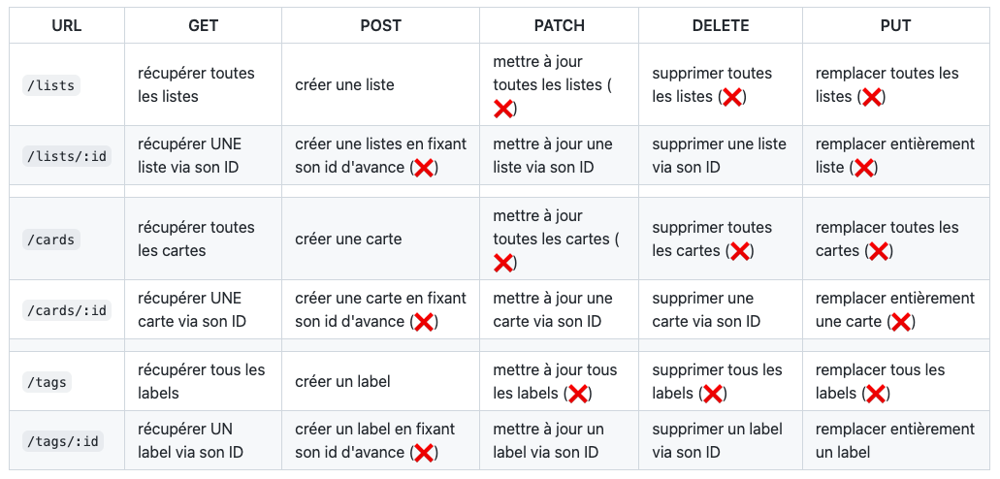

# O'Kanban - E04 - REST API (suite)

## Menu du jour

### Cockpit matin

- Correction
  - Routes `/lists`

- REST API :
  - Conventions
  - HTTP Testing
    - Insomnia
    - Thunder client
  - Input validation

- Bonus
  - Prefix API
  - Multi-router
  - Gestion des erreurs
    - ✅ 500 wrapper
    - 404 middleware
  - Documentation
  - E2E Testing automatisé

### Atelier aprem'

- `REST API` : toutes les routes restantes !


## API REST

L'objectif d'une API Web HTTP est de **fournir un accès à des données via HTTP**, que ça soit en lecture ou en écriture. On ne renvoie plus de page web, mais plutôt les données brutes, qu'on appelle des **ressources**, consommables par n'importe quel **client**.

Une API `REST` est une Web API qui respecte certaines **conventions**/bonnes pratiques.

### Chemin des routes (par l'exemple)



### Des verbes 

- `GET` : lire
- `POST` : créer
- `PATCH` : update (partiel)
- `DELETE` : supprimer
- `PUT` : remplacer (total)

Différence PUT/PATCH : MDN pour la différence exacte

### Données reçues et envoyées

Une API accepte généralement des données via :
- des **query params** (paginations, filtres, ...)
- des **body** (création de données, mise à jour de ressources) au format `application/json` ou `application/x-www-urlencoded`.

Une API renvoie généralement des données via :
- le **body** des réponses au format `application/json`

Exemple : 

<details><summary>
Requête
</summary>

```
Verb : POST
Route : /lists
Body type: application/json
Body content : 
{
  "name": "Choses à faire",
  "position": 12
}
```

</details>


<details><summary>
Réponse
</summary>

```
Code : 201
Body type : application/json
Body content : 
{
  "id": 42,
  "name": "Choses à faire",
  "position": 12,
  "created_at": "2022-12-14T07:55:26.547Z",
  "updated_at": null
}
```

</details>


### Status code renvoyé

On distingue, entre autre : 
- les `2XX` : les code de succès.
- les `4XX` : les code d'erreurs client.
- les `5XX` : les code d'erreurs serveurs.

Erreur client = le client a fait une bétise.

Erreur serveur = le backend a fait une bétise. 


Ex : `GET /auteurs` renvoie une 404. C'est normal on l'a pas créé. C'est une erreur du client il n'a pas à nous demander ça 

Ex : `GET /lists` et que la BDD explose pour une raison X ou Y. C'est une erreur du serveur. C'est grave il faut la résoudre pour rendre le service à nouveau accessible.

Ex : `GET /lists/350` et que la liste avec l'ID 350 n'existe pas, la bonne convention (REST) c'est de renvoyer une 404 avec un message d'erreur approprié.

Exemples les plus courant :

| Code | Nom | Explication |
| -- | -- | -- | 
| 200 | OK | La requête est traitée avec succès et la réponse attendue envoyée au client.
| 201 | Created | La requête est traitée avec succès, la réponse attendue envoyée au client et une entité a été créée en base de données.
| 400 | Bad request | La requête est invalide. Ex : manque un champ obligatoire ou un champ est fourni au mauvais format.
| 401 | Unauthorized | Le client ne s'est pas authentifié.
| 403 | Forbidden | Le client est authentifié mais n'a pas les droits pour accéder à la ressource.
| 404 | Not found | La route ou la ressource n'existe pas sur le serveur.
| 429 | Too Many Requests | La requête est bloquée car le nombre limite de requête par unité de temps est dépassé. Le client doit attendre avant de faire une requête supplémentaire. 
| 500 | Internal Server Error  | Une erreur non gérée est survenu côté serveur. Les développeurs doivent réagir pour débloquer la situation. 


Plus sur [wikipedia](https://en.wikipedia.org/wiki/List_of_HTTP_status_codes)

## Consommation d'une API

On peut consommer une API Web à l'aide de n'importe quel client HTTP. Par exemple : 

| Client | Support | Notes | 
| -- | -- | -- | 
| Insomnia | Application | Possibilité de créer des collections de requêtes |
| Postman | Application | Possibilité de créer des collections de requêtes |
| Thunder Client | VScode Extension | Possibilité de créer des collections de requêtes | 
| HTTP REST Client | VSCode Extension | Pratique pour versionner quelques tests dans la code base |
| cURL | Terminal | Rien à installer mais assez austère |
| Chrome | Barre d'URL | Uniquement requête `GET` |
| fetch | JavaScript | Requête via du code JavaScript pour traitement ultérieur | 


## Res.json

`res.json()` c'est pour renvoyer au client de la donnée brute, au format JSON. 

C'est un `res.send()` au format JSON. 

## Controller 

La logique est généralement la suivant: 

- Récupérer et parser les inputs

  - Valider les inputs

  - Traitement : 
    - recupérer la donnée
    - création de données
    - etc

  - Renvoyer une réponse adaptée


Controller = garantissent la sécurité du code. 
- Vérification des inputs  de l'appellant (client) 

Considérez que votre API sera appelée par qqun de mal intentionné. 

**N'oubliez de TESTER que vous avez bien branché votre controller dans votre router**
ex : `res.json({});` puis tester dans Insomnia / Postman


> on est obligé de mettre le status qd il n'y a pas d'erreur ? (200, 201...)

Non. Par défaut Express met un status `200`. Mais si on veut un statut particulier (pour respecter la specification, la norme REST, pour être explicite), alors mieux vaut le faire. 


**Never trust user input**